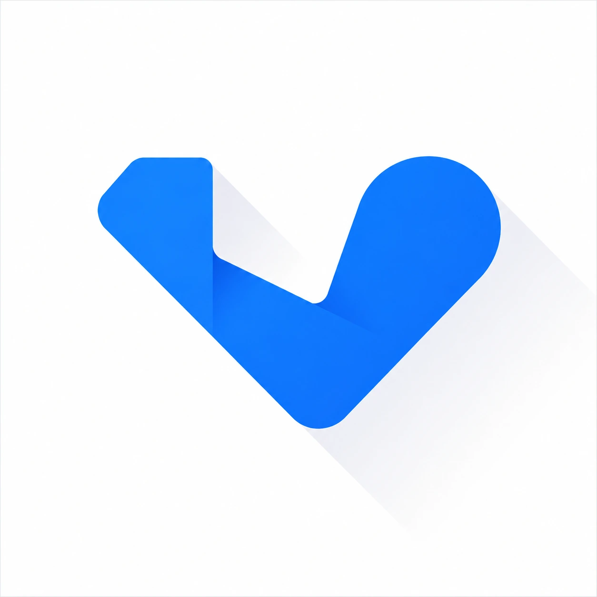

<p align="center">
  
</p>

<h1 align="center">Vexon</h1>
<p align="center">A premium, AI fitness app for Flutter, coached by <b>Nox</b>.</p>

---

## Overview

Vexon is a fitness tracking app built around one idea: training, nutrition,
and progress should feel like they're guided by a coach who actually knows
you, not a generic tracker you fill in and ignore. An onboarding flow
captures your body stats, goal, and experience level once; that data then
personalizes the dashboard, the workout generator, and every reply from
Nox, the in-app AI coach.

The app is fully client-side. All data - profile, streaks, logged meals,
chat history, scheduled workouts - is stored on-device with
`shared_preferences`. The only network calls are to the Gemini API, and
only when you talk to Nox or generate a workout plan.

## Features

**Onboarding & personalization**
- Four-step setup collecting age, height, weight, fitness goal, and
  experience level
- A BMR-based calorie target is calculated automatically from that data
  and used to seed the Home and Nutrition dashboards
- Every field is editable later from Settings, and changes propagate
  everywhere that reads them - there is a single stored profile, not a
  copy per screen

**Nox - the AI coach**
- Dedicated chat interface backed by the Gemini API
- Context-aware: Nox is given your goal, experience level, and your most
  recently completed workouts on every request, so advice builds on your
  history instead of repeating generic tips
- AI workout generator: pick a goal, time available, and experience
  level, and Nox returns a structured, numbered session plan

**Dashboard & tracking**
- Home: greeting, a daily "mission" (workout + calorie target) with an
  animated progress bar, streak counter, and quick actions
- Workouts: category and difficulty filters, workout detail pages, and a
  one-tap "mark complete" that updates your streak and weekly analytics
- Progress: an analytics dashboard built with `fl_chart` - an animated
  calorie ring, a weekly calories-burned bar chart, a weight-trend line
  chart, and a streak visualization
- Nutrition: daily calorie tracking against your target, a
  breakfast/lunch/dinner meal log, high-protein suggestions, and a
  water tracker capped at its daily goal
- Calendar: assign a workout to any date and see your schedule at a
  glance, built with `table_calendar`

**Engagement**
- Three achievement badges (First Workout, 7-Day Streak, 30-Day Streak),
  computed live from your existing streak and completed-workout data
- Local daily reminders for workouts, water, and meals, toggled from
  Settings - no backend or push service required
- Clean empty states with a call to action wherever a screen has no data
  yet, instead of a blank or half-built layout

**Engineering details**
- A five-tab bottom navigation shell where tab switches are driven by a
  small shared signal (`TabNavigation`) rather than screen pushes, so
  "Start Workout" from Home lands you on the real Workouts tab instead
  of a disconnected duplicate
- A daily rollover check resets "today" values (calories logged, water,
  logged meals) once per day on cold start
- Fast, subtle fade-and-slide transitions between screens, and tweened
  progress indicators instead of instant jumps

## Tech stack

| Purpose | Package |
|---|---|
| Framework | Flutter (Dart >= 3.0) |
| AI coach + workout generator | [Gemini API](https://ai.google.dev/) via `http` |
| Local persistence | `shared_preferences` |
| Environment variables | `flutter_dotenv` |
| Charts (Progress screen) | `fl_chart` |
| Calendar (scheduling) | `table_calendar` |
| Typography | `google_fonts` (Poppins / Inter) |
| Local notifications | `flutter_local_notifications`, `timezone` |

## Project structure

```
lib/
  main.dart                        # Entry point: loads .env, notifications, daily rollover
  theme/
    app_colors.dart                # Brand palette (primary blue + dark background)
    app_text_styles.dart           # Poppins / Inter type scale
    app_theme.dart                 # Global ThemeData
  models/
    workout.dart                   # Workout model + seed catalog (category, difficulty)
    meal.dart                      # Meal model + seed plan + protein suggestions
    chat_message.dart              # Nox chat message model
    user_profile.dart              # Onboarding data: age, height, weight, goal, experience
    achievement.dart                # Badge definitions and unlock predicates
  services/
    auth_service.dart              # Signup / login
    storage_service.dart           # All local persistence - single source of truth
    notification_service.dart      # Local notification scheduling
    gemini_service.dart            # Gemini API integration for Nox + workout generator
    tab_navigation.dart            # Shared signal for switching HomeShell tabs
  widgets/
    app_logo.dart
    primary_button.dart
    vexon_card.dart                # Light card surface + dark card variant
    stat_card.dart
    section_header.dart
    error_feedback.dart
    empty_state.dart                # Icon + message + CTA for screens with no data
    achievement_badge.dart          # Badge strip (Home) and full list (Profile)
    animated_progress.dart          # Tweened linear/ring progress indicators
    page_transitions.dart           # Fade + slide navigation transition
  screens/
    splash_screen.dart
    onboarding_screen.dart
    login_screen.dart
    signup_screen.dart
    home_shell.dart                 # Bottom nav: Home / Workouts / Progress / Nutrition / Profile
    home_screen.dart
    workouts_screen.dart
    workout_detail_screen.dart
    progress_screen.dart
    nutrition_screen.dart
    profile_screen.dart
    settings_screen.dart
    nox_chat_screen.dart
    workout_generator_screen.dart
    calendar_screen.dart
public/
  assets/
    LOGO.webp                       # App logo
  images/                           # Empty - reserved for future image assets
.env.example                        # Template for GEMINI_API_KEY / MODEL_NAME
```

## Getting started

### Prerequisites

- [Flutter SDK](https://docs.flutter.dev/get-started/install) (stable
  channel, Dart >= 3.0)
- A Gemini API key from [Google AI Studio](https://aistudio.google.com/apikey)

### Setup

This repository contains only `lib/`, `public/`, `pubspec.yaml`,
`.env.example`, and this README - the platform folders (`android/`,
`ios/`, etc.) are generated by the Flutter CLI, not checked in.

1. **Create the platform scaffolding** in an empty folder:
   ```bash
   flutter create --org com.example vexon
   ```
2. **Copy this repository's `lib/`, `public/`, and `pubspec.yaml` into
   it**, overwriting the generated versions.
3. **Set up your environment file:**
   ```bash
   cp .env.example .env
   ```
   Then open `.env` and add your real Gemini API key:
   ```
   GEMINI_API_KEY=your_actual_key_here
   MODEL_NAME=gemini-3.6-flash
   ```
   Without a real key, Nox chat and the AI workout generator show a
   clear inline error instead of crashing - everything else in the app
   works fully offline.
4. **Install dependencies:**
   ```bash
   flutter pub get
   ```
5. **Android notification permission.** Open
   `android/app/src/main/AndroidManifest.xml` and add this line inside
   the `<manifest>` tag, above `<application>`:
   ```xml
   <uses-permission android:name="android.permission.POST_NOTIFICATIONS"/>
   ```
6. **Run the app:**
   ```bash
   flutter run
   ```

### Demo login

- Username: `testuser`
- Password: `password123`

Or use the Sign Up screen to create your own account, which is persisted
locally on the device.

## How personalization works

Onboarding writes a single `UserProfile` record (age, height, weight,
goal, experience) through `StorageService`. That same record is read by:

- **Home / Nutrition** - to seed the daily calorie target
- **Nox** - injected into the system prompt on every chat message,
  along with the last few completed workout titles, so responses stay
  specific instead of generic
- **The workout generator** - to pre-fill goal and experience level
- **Settings** - as the single place to edit all of it later

There is no second copy of this data anywhere in the app. Editing your
goal on the Profile screen, for example, updates the exact record Nox
reads on your next message.

## Known limitations

- Single-device only - there is no backend, sync, or account recovery.
  Uninstalling the app clears all data.
- The Gemini API key ships in a bundled `.env` file, which is
  acceptable for a personal or demo build but is not a secure pattern
  for a published app with real users; a production release should
  proxy Gemini calls through a server instead.
- No automated tests yet.
- Platform folders (`android/`, `ios/`) are not included and must be
  generated locally via `flutter create`, as noted above.

## License

This is a personal project and does not currently specify an open
source license. Contact the author before reusing the code or assets.
